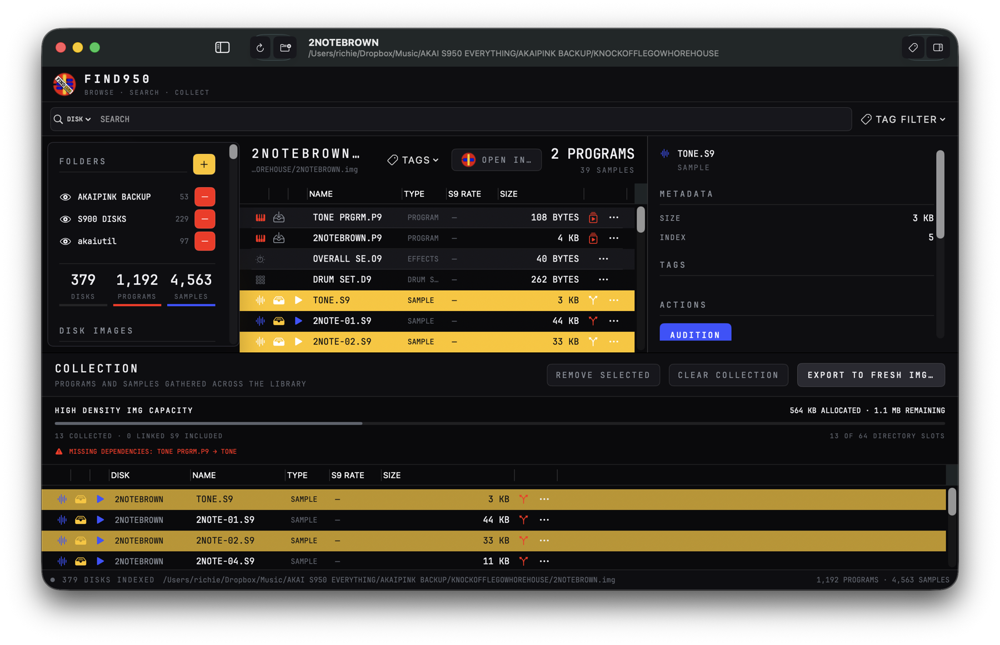
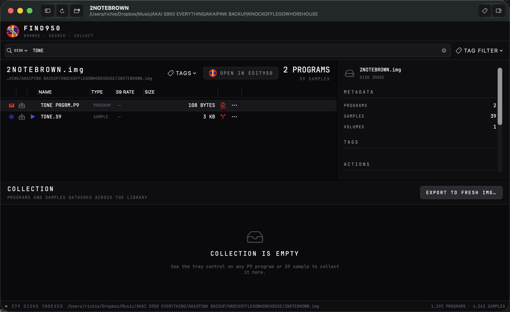
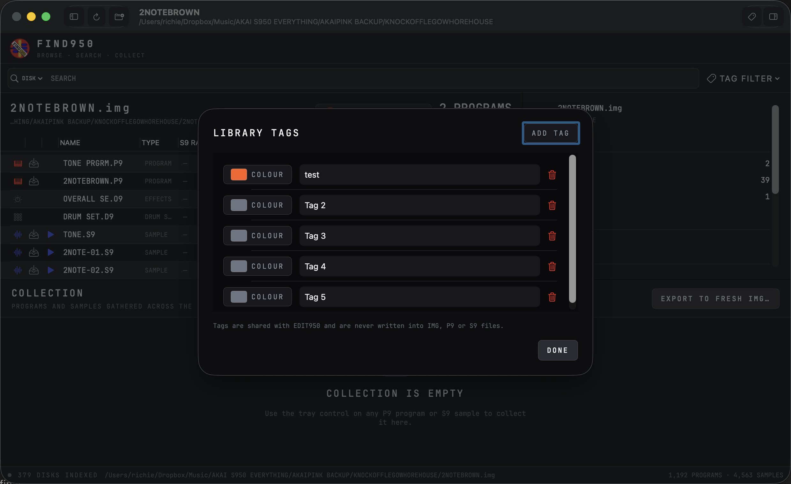

# FIND950 musician’s guide

FIND950 turns a folder full of old S900 and S950 disk images into a library you
can browse, search and audition. It does not change the disks. Think of it as a
record shop for your own sampler archive: find the sound first, then decide
whether to play it, edit it or build a smaller working disk around it.

This guide assumes macOS 14 or later.

## Three old sampler terms you will see

You do not need to understand the file format. These three labels are enough:

| Label | What it means to a musician |
| --- | --- |
| **IMG** | A copy of a complete sampler disk. |
| **P9 program** | The playable instrument: keyboard zones, tuning, layers, envelopes and output choices. |
| **S9 sample** | One recording used by a program. |

## Install FIND950

1. Download the latest Universal macOS ZIP from the
   [FIND950 releases page](https://github.com/richiewarburton/FIND950/releases/latest).
2. Open the ZIP.
3. Move **FIND950.app** to `/Applications`.
4. Open FIND950. If macOS blocks the first launch, Control-click the app, choose
   **Open**, then confirm.

AKAI Util 4.6.7 is included with FIND950. No separate download, EDIT950
installation, path selection, `chmod` command or other Terminal setup is
required. FIND950 uses the included helper read-only to inspect IMG files and
prepare temporary audition audio. Safe Eject is separate native FIND950 code.

## Your first five minutes

1. Click **Add Folders**.
2. Choose the folder that contains your `.img` disk backups. You can choose a
   top-level folder; subfolders are included.
3. Leave FIND950 open while it reads the collection for the first time.
4. Choose a disk in the left side of the window.
5. Select a sample and press **Audition**.

The window is arranged like a music library:

- **Folders and disks** are on the left.
- **Programs and samples on the selected disk** are in the middle.
- **Details and useful actions** appear on the right.
- **Collection** at the bottom is a temporary tray for sounds you want to put
  onto a fresh IMG.

The totals at the bottom tell you how much of the archive has been indexed. The
first scan can take a while; later launches are much quicker because FIND950
only checks disks that are new or changed.

## Keyboard shortcuts

These are the useful ones to remember. You can also find them beside their
commands in the menus at the top of the screen.

| Shortcut | What it does |
| --- | --- |
| **Space** | Audition the selected sample. Press it again to stop. |
| **Command-F** | Put the cursor in Search. |
| **Command-O** | Add another folder of IMG disks. |
| **Control-Command-S** | Show or hide the folder list. |
| **Option-Command-I** | Show or hide the details, tags and actions. |
| **Command-minus** | Make the FIND950 display smaller. |
| **Command-0** | Return the display to its normal size. |
| **Command-plus** | Make the FIND950 display larger. |
| **Command-Z** | Undo the last change to your collection or tags. |
| **Shift-Command-Z** | Redo the change. |

Space works when a sample is selected. It will not start audition while you are
typing in Search.

## Find a sound you remember

Click the search field or press Command-F, then type any part of a program or
sample name. Use the menu at the left of the search field to choose whether to
search the current disk or the whole library.

A useful way to work is:

1. Search the whole library for a word such as `BASS`, `KICK`, `CHOIR` or part
   of an old song name.
2. Select a promising sample.
3. Press **Audition**.
4. Choose **Programs Using This Sample** to find the playable programs that use
   it.

This last step matters. A sample may sound plain on its own, while the original
program adds the keyboard spread, tuning, layers, envelope and filter movement
that made it musical.

To return to ordinary browsing, click the small × in the search field.

## Audition samples without making a mess

Select an S9 sample and press **Audition**, or use its blue play button. Press
again to stop.

FIND950 makes a temporary listening copy, plays it, then removes it. It does not
fill your archive with WAV files and it never changes the IMG.

If you do want a permanent WAV, select the sample and choose **Export as WAV…**.

## Use tags like record-box stickers

Tags are useful for musical thoughts that are not in the original disk names:

- warm pads;
- nasty drums;
- try in track;
- favourite basses;
- source for live set.

Open **Tags** to create names and colours.

Use the tag menu on a disk, program or sample to apply a tag. Use **Tag Filter**
above the library to show only matching items.

EDIT950 and FIND950 share the same tags. Tags are kept in a separate library
file; they are not written into your sampler disks.

## Send a sound to the right place

Once you have found something, you have three good choices.

### Play it now in a DAW

Open PLAY950 in the DAW first. In FIND950, select a P9 program and choose
**Open in PLAY950**. PLAY950 loads the disk and selects that program.

If nothing happens, make sure a PLAY950 editor window is open in the DAW.

### Open the disk for editing

Choose **Open in EDIT950** to inspect or change the disk. FIND950 itself remains
read-only.

### Make a small IMG around one program

Select a P9 and choose **Export Program Through EDIT950…**. EDIT950 opens the
program, finds the samples it uses, asks where the new disk should go and checks
the finished result.

This is the easiest way to make a focused working disk for a Gotek, an S950 or a
tidier studio folder.

## Build your own collection disk

The **Collection** area lets you gather an exact set of programs and samples
from anywhere in the library.

1. Use the tray button on a P9 or S9 row to add it.
2. Keep searching and add more items from other disks.
3. Watch the space and directory-slot meters at the bottom.
4. If FIND950 reports missing samples for a program, add the named S9 samples if
   you want that program to be complete.
5. Choose **Export to Fresh IMG…**.

Collection export is literal: it copies the items you selected. It does not
silently add every sample used by a P9. That makes unusual combinations
possible, but it also means the missing-sample warning is worth reading.

EDIT950 performs the actual disk creation and verifies the finished IMG.

## Keep the library comfortable

Open **FIND950 → Settings** to change the display size, row spacing, sidebar and
inspector. These choices only affect how FIND950 looks.

Safe Eject cleanup rules are also available in Settings. FIND950 previews every
matched metadata item before deletion, then re-scans the volume. If macOS
protects an item such as `.Spotlight-V100`, FIND950 stops and leaves the drive
mounted rather than claiming it is clean. Grant FIND950 Full Disk Access in
**System Settings → Privacy & Security → Full Disk Access**, quit and reopen the
app, then try again.

FIND950 and EDIT950 coordinate removable-volume use. If EDIT950 has an IMG open
on the same drive, or FIND950 is actively scanning, extracting an audition,
exporting or preparing a handoff, Safe Eject stops before cleanup and names the
operation that is still using the drive. Selecting and browsing an already
cached FIND950 disk does not keep the drive busy. After a successful eject the
cached catalogue remains searchable, is marked offline and reconnects when the
same media returns.

The **Diagnostic Log** control shows a persistent, size-limited activity
timeline. It records actions and errors, not IMG or audio contents, and shortens
home and temporary paths. Use its **Copy**, **Save**, **Reveal** and **Clear**
buttons when an intermittent problem is difficult to describe. Settings can
open the log automatically when an error occurs.

You can also choose where the search index and shared tag file live. Moving the
index does not move your IMG collection.

If you keep tags in Dropbox or another synced folder, avoid changing them on two
Macs at the same time.

## What FIND950 will never do

FIND950 will not:

- change, rename or delete files inside an IMG;
- format an IMG or a physical disk;
- write to a floppy drive;
- alter your source folder while scanning or auditioning.

Keep an independent backup anyway. Old disk images are often irreplaceable.

## Quick fixes

### My folder is present but a new IMG is missing

Press **Rescan**. If only one disk changed, use **Rescan This Image** from that
disk’s menu.

### Audition does not work

Check that the selected item is an S9 sample, not a P9 program. If FIND950 says
its included helper is missing or damaged, reinstall FIND950; there is no helper
path or executable permission to configure.

### Open in PLAY950 does nothing

Add PLAY950 to a DAW track and leave its editor window open, then try again.

### Open in EDIT950 does nothing

Make sure EDIT950 is installed in `/Applications`.

### Search results feel too narrow

Change the search menu from **This Disk** to **All Disks**, and clear any active
tag filter.

## A simple musical workflow

1. Search for a half-remembered name in FIND950.
2. Audition a few samples.
3. Find the original program that used the best one.
4. Open it in PLAY950 and play it from MIDI.
5. If it needs work, open the disk in EDIT950.
6. Save the DAW project; PLAY950 keeps the loaded sound with the project.

That is the whole 950TOOLS idea: **find it, shape it, play it**.
